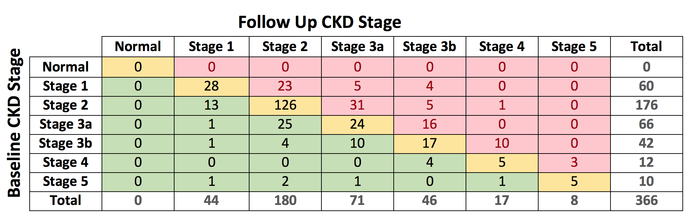
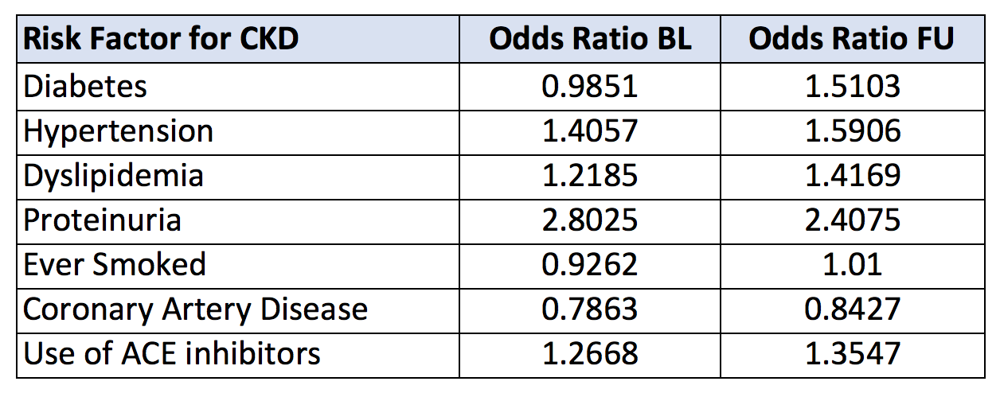
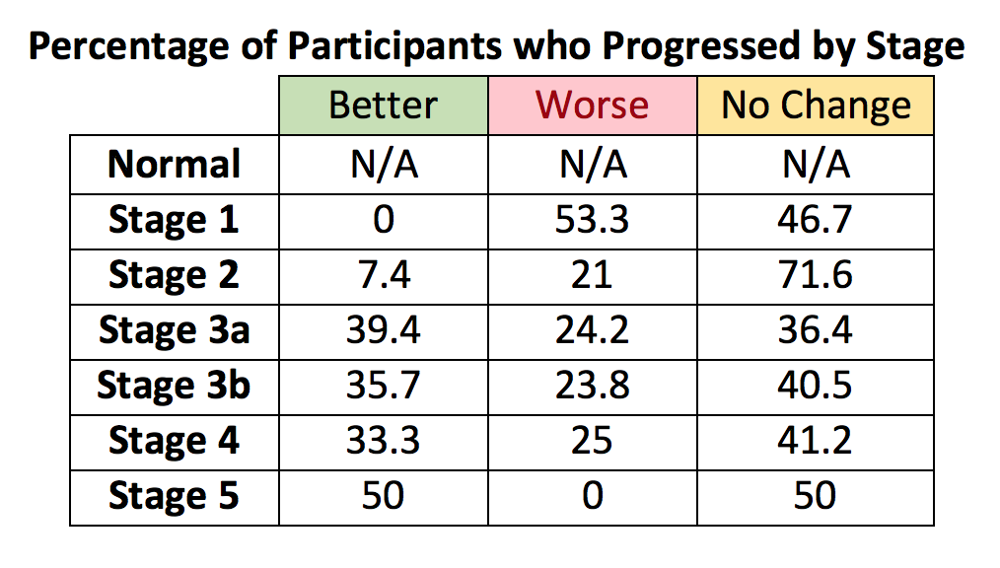

```{r setup, include = FALSE}
library(knitr)
  opts_chunk$set(echo = FALSE, cache = TRUE, autodep = TRUE, 
                 message = FALSE, warning = FALSE)
library(tidyverse)
library(broom)
library(readxl)
library(GGally)
library(gridExtra)
library(e1071)
library(lmtest)
```

\newpage

# Overview of the Clinical Issue

Since 2004, chronic kidney disease (CKD) has continued to affect approximately 14 percent of people. CKD is characterized by protein in the urine, high blood pressure, anemia, nerve damage, heart and blood vessel disease, and can eventually lead to kidney failure requiring dialysis or a kidney transplant in its later stages. CKD is defined by five stages based on a numeric value of glomerular filtration rate (GFR). However, in its earlier stages (1 to 3A), there are few noticeable symptoms which allows the disease to progress unnoticed until it is detrimental to a person’s health. Furthermore, people that are diagnosed with CKD are generally known to have higher risk for comorbid conditions such as cardiovascular disease and diabetes which can complicate treatment.

If a biomarker can be identified to help detect CKD earlier, then treatment can be implemented to prevent the progression of kidney disease. In recent research, soluble urokinase-type plasminogen activator receptor (suPAR) has been investigated as a biomarker in the development of kidney disease, yet it is still unknown if increased suPAR levels can accurately determine future kidney dysfunction. Through this data analysis, we aimed to determine the relationship between suPAR and GFR as well as if suPAR levels can be used to predict decline in kidney function through CKD stage progression while considering covariates[^1] ("Kidney Disease Statistics in the United States"). 

[^1]: Covariates: clinical CKD at baseline, C-reactive protein, age, sex, myocardial infarction, hypertension, diabetes, dyslipidemia, proteinuria, smoking, coronary artery disease (CAD), and use of angiotensin-converting enzyme (ACE) inhibitors or angiotensin receptor blockers (ARBs)

\newpage

# Summary of Patient Characteristics at Baseline

\newpage

# Research Objectives

```{r load-data}
GFR <- read_excel("SIBS_GFRdata.xlsx", na = ".")

# Make indicator for whether patient has CKD at enrollment
GFR <- mutate(GFR, BL_CKD = ifelse(BL_GFR < 60, "Yes", "No"))
GFR <- mutate(GFR, FU_CKD = ifelse(BL_GFR < 60, "Yes", "No"))

# Make indicator for whether patient's CKD worsened at follow-up:
# Recode baseline CKD stages as numbers:
GFR <- mutate(GFR, BL_num_CKD = BL_GFR)
GFR$BL_num_CKD <- ifelse(GFR$BL_num_CKD >= 120, 0,
                  ifelse(GFR$BL_num_CKD >= 90, 1,
                  ifelse(GFR$BL_num_CKD >= 60, 2,
                  ifelse(GFR$BL_num_CKD >= 45, 3,
                  ifelse(GFR$BL_num_CKD >= 30, 4,
                  ifelse(GFR$BL_num_CKD >= 15, 5, 6))))))

# Recode follow-up CKD stages as numbers:
GFR <- mutate(GFR, FU_num_CKD = FU_GFR)
GFR$FU_num_CKD <- ifelse(GFR$FU_num_CKD >= 120, 0,
                  ifelse(GFR$FU_num_CKD >= 90, 1,
                  ifelse(GFR$FU_num_CKD >= 60, 2,
                  ifelse(GFR$FU_num_CKD >= 45, 3,
                  ifelse(GFR$FU_num_CKD >= 30, 4,
                  ifelse(GFR$FU_num_CKD >= 15, 5, 6))))))

GFR <- mutate(GFR, progression = FU_num_CKD - BL_num_CKD) # if positive, CKD got worse
GFR$progression <- ifelse(GFR$progression > 0, 1, 0) # 1 for worse; 0 for same or better
```

## 1. What is the relationship between suPAR and GFR at baseline?

```{r obj1-linearity}
GFR %>% ggplot(aes(x = suPARpgml, y = BL_GFR)) + geom_point() + ggtitle("Relationship between suPAR and baseline GFR for all patients") + labs(x = "suPAR", y = "Baseline GFR")
```

```{r obj1-corr, eval = FALSE}
# Pearson's correlation for suPAR and baseline GFR (all patients):
cor.test(GFR$suPARpgml, GFR$BL_GFR)

# Spearman's correlation for suPAR and baseline GFR (all patients):
cor.test(GFR$suPARpgml, GFR$BL_GFR, method = "spearman")
```

To determine the relationship between suPAR and GFR at baseline, we ran a Pearson's correlation test. There is a moderate negative correlation between suPAR and baseline GFR, as evidenced by the correlation coefficient of $-0.528$. The correlation is also statistically significant with a very small p-value < $2.2 \times 10^{-16}$. This means that as GFR increases, the amount of suPAR decreases, and vice versa.

```{r obj6-1-graphs}
has.ckd.scatter <- GFR %>% filter(BL_CKD == "Yes") %>% ggplot(aes(x = suPARpgml, y = BL_GFR)) + geom_point() + ggtitle("Patients with CKD at enrollment") + labs(x = "suPAR", y = "GFR")

no.ckd.scatter <- GFR %>% filter(BL_CKD == "No") %>% ggplot(aes(x = suPARpgml, y = BL_GFR)) + geom_point() + ggtitle("No CKD at enrollment") + labs(x = "suPAR", y = "GFR")

grid.arrange(has.ckd.scatter, no.ckd.scatter, top = "Relationship between suPAR and baseline GFR, stratified by CKD at enrollment")
```

We also stratified by whether the patient has CKD at enrollment (i.e. baseline GFR $< 60$). The relationship between suPAR and GFR changed after stratification. The scatterplots show a moderately strong negative correlation for patients with CKD, but for patients without CKD, the correlation is weak.

```{r obj6-1, eval = FALSE}
# Pearson's correlation among those who have CKD at enrollment:
cor.test(GFR$suPARpgml[GFR$BL_CKD == "Yes"], GFR$BL_GFR[GFR$BL_CKD == "Yes"])

# Pearson's correlation among those who do not have CKD at enrollment:
cor.test(GFR$suPARpgml[GFR$BL_CKD == "No"], GFR$BL_GFR[GFR$BL_CKD == "No"])
```

Among patients who had clinical CKD at enrollment ($n = 130$), the correlation coefficient is $-0.655$, which indicates a stronger negative correlation between suPAR and baseline GFR than we saw for all patients together. This association suggests that people with clinical CKD (and therefore lower GFR) will generally have higher amounts of suPAR.

Among patients who did _not_ have clinical CKD at enrollment ($n = 236$), the correlation coefficient is $-0.144$, which indicates a much weaker correlation between suPAR and baseline GFR than we saw for all patients together. Baseline GFR decreases only slightly with increasing suPAR among patients without CKD.

## 2. Can suPAR levels at baseline predict decline of kidney function at one year?

```{r obj2}
# Create a new variable for the difference in GFR (follow-up – baseline):
GFR$diff_GFR <- GFR$FU_GFR - GFR$BL_GFR # positive indicates improvement

mod2 <- lm(diff_GFR ~ suPARpgml, data = GFR)
mod2.inter <- lm(diff_GFR ~ suPARpgml + BL_CKD + suPARpgml*BL_CKD, data = GFR)
```

We fitted a linear regression model for the difference in GFR (follow-up – baseline) against suPAR levels. Since a lower GFR score indicates worse kidney functioning, a positive difference indicates improvement, and a negative difference indicates worse functioning.

When suPAR level was the sole predictor in the model, it was statistically insignificant ($t = 1.81$, p-value = $0.07$) and thus not a sufficient predictor for difference in GFR. However, in a multiple linear regression model using suPAR level, clinical CKD status as an indicator variable, and an interaction term between clinical CKD status and suPAR level as predictors of the difference in GFR, we found suPAR level ($t = -2.57$, p-value $= 0.01$) and the interaction between clinical CKD and suPAR level ($t = 2.63$, p-value $< 0.01$) to be statistically significant. Clinical CKD status ($t = 0.33$, p-value $= 0.74$) was not significant.[^2]

13.05 percent of the variation in GFR difference is explained by the model with suPAR level, clinical CKD status, and the interaction between clinical CKD status and suPAR level. The fitted regression line is
$$\Delta \text{GFR} = -0.114 - 0.002(\text{suPAR}) + 1.555(\text{CKD status}) + 0.003(\text{suPAR*CKD status}).$$

The significance of the interaction term means that the relationship between suPAR and $\Delta$GFR changes based on whether or not patients have clinical CKD at enrollment.

Difference in GFR _decreases_ by 0.002 mL/min/1.73m$^2$ for each 1 pg/mL increase in suPAR when patients do _not_ have clinical CKD at enrollment. Difference in GFR _increases_ by 0.001 mL/min/1.73m$^2$ for each 1 pg/mL increase in suPAR when patients _do_ have clinical CKD at enrollment.

So the fitted model when CKD = 0 is $$\Delta \text{GFR} = -0.114 - 0.002(\text{suPAR}),$$ and the fitted model when CKD = 1 is $$\Delta \text{GFR} = 1.441 + 0.001(\text{suPAR}).$$

[^2]: See [Section 2](#output-for-research-objective-2) in the [Appendix](#appendix).

## 3. Can suPAR measured at baseline predict the risk of CKD stage progression?

In order to evaluate CKD stage progression, we created a binary variable called progression which is equal to 1 if CKD stage progression has occurred (i.e. stage at follow-up is worse than at baseline) and 0 if it has not (i.e. stage at follow-up has improved or stayed the same as baseline).




We used a logistic regression model to determine whether suPAR measured at baseline can predict the risk of CKD stage progression. suPAR level is a continuous variable ranging from 878 pg/mL to 10,228 pg/mL.

The fitted odds are
$$\dfrac{\hat{p}}{1 - \hat{p}} = \exp(-1.540 + (1.425 \times 10^{-4}\text{ * suPAR})),$$
where $\hat{p}$ is the estimated probability that CKD progresses.

```{r obj3}
# Logistic regression model for CKD stage progression vs. suPAR:
log1 <- glm(progression ~ suPARpgml, data = GFR, family = "binomial")
# exp(coef(log1)) %>% kable(col.names = "Odds ratio", digits = 4)
```

From the model, for every unit increase in suPAR, the odds of stage progression increases by a factor of 1.0001, which was found to be statistically significant (p-value = $0.0374$). This means that for a one unit increase in suPAR, the odds of having CKD progression are roughly the same (very slight increase).

Although this increase in odds is statistically significant, it is probably too small to be clinically significant. We would need to know how much of an increase in suPAR is clinically meaningful. For example, maybe a change of $\pm 1$ pg/mL of suPAR can be attributed to instrument error. If we consider 1,000 pg/mL to be the smallest clinically meaningful increase in suPAR, then for an increase of 1,000 pg/mL of suPAR, the odds of stage progression occuring increases by a factor of $1.0001^{1000} = 1.154$, which is large enough to be measured.

## 4. Are any categorical variables associated with CKD stage progression?

```{r obj4}
# Chi-square tests of independence for each categorical covariate and CKD stage progression:
chi.mi <- chisq.test(GFR$EverMI, GFR$progression)
chi.diabetes <- chisq.test(GFR$DM, GFR$progression)
chi.hypertension <- chisq.test(GFR$HTN, GFR$progression)
chi.dyslipidemia <- chisq.test(GFR$Dyslipidemia, GFR$progression)
chi.proteinuria <- chisq.test(GFR$Proteinuria, GFR$progression)
chi.smokers <- chisq.test(GFR$EverSmoked, GFR$progression)
chi.cad <- chisq.test(GFR$CAD, GFR$progression)
chi.ace <- chisq.test(GFR$acearb, GFR$progression)
```

To determine which variables were associated with CKD stage progression, we ran a series of chi-square tests of independence for stage progression against each of the following categorical variables: clinical CKD at baseline, sex, history of myocardial infarction, coronary artery disease, hypertension, diabetes, dyslipidemia, and use of ACE inhibitors or ARBs[^3]. We found that there was no association between any of the variables and CKD stage progression at a significance level of $\alpha = 0.05$.

[^3]: Sample sizes for each test can be found in the [Appendix](#sample-sizes-for-objectives-4-5).

$~$

```{r obj4-table}
covariates <- c("Myocardial infarction", "Diabetes", "Hypertension", "Dyslipidemia", "Proteinuria", "Smoking", "Coronary artery disease", "Use of ACE/ARBs")

p.names <- data.frame(c(chi.mi$p.value, chi.diabetes$p.value, chi.hypertension$p.value, chi.dyslipidemia$p.value, chi.proteinuria$p.value, chi.smokers$p.value, chi.cad$p.value, 0.999), row.names = covariates)

kable(p.names, col.names = "p-value", digits = 3)
```

All chi-square tests resulted in p-values larger than 0.05, so we fail to reject all null hypotheses that CKD stage progression is independent of each of the variables. There is not enough evidence to suggest that CKD stage progression and each of these categorical covariates are associated.

## 5. At baseline, what is the risk of clinical CKD for those with diabetes, hypertension, dyslipidemia, proteinuria, or coronary artery disease (CAD)? For smokers, users of ACE/ARBs? Do any associations change at follow-up?

```{r recode-CKD, echo = FALSE}
GFR <- mutate(GFR, BL_CKD = ifelse(BL_CKD == "Yes", 1, 0))
GFR <- mutate(GFR, FU_CKD = ifelse(FU_CKD == "Yes", 1, 0))
```

```{r obj5}
# Logistic regression models for CKD status vs. each categorical covariate at baseline:
diabetes <- glm(BL_CKD ~ DM, data = GFR, family = "binomial")
hypertension <- glm(BL_CKD ~ HTN, data = GFR, family = "binomial")
dyslipidemia <- glm(BL_CKD ~ Dyslipidemia, data = GFR, family = "binomial")
proteinuria <- glm(BL_CKD ~ Proteinuria, data = GFR, family = "binomial")
smokers <- glm(BL_CKD ~ EverSmoked, data = GFR, family = "binomial")
heartdisease <- glm(BL_CKD ~ CAD, data = GFR, family = "binomial")
ACE <- glm(BL_CKD ~ acearb, data = GFR, family = "binomial")

# Logistic regression models for CKD status vs. each categorical covariate at follow-up:
FU_diabetes <- glm(FU_CKD ~ DM, data = GFR, family = "binomial")
FU_hypertension <- glm(FU_CKD ~ HTN, data = GFR, family = "binomial")
FU_dyslipidemia <- glm(FU_CKD ~ Dyslipidemia, data = GFR, family = "binomial")
FU_proteinuria <- glm(FU_CKD ~ Proteinuria, data = GFR, family = "binomial")
FU_smoker <- glm(FU_CKD ~ EverSmoked, data = GFR, family = "binomial")
FU_heartdisease <- glm(FU_CKD ~ CAD, data = GFR, family = "binomial")
FU_ACE <- glm(FU_CKD ~ acearb, data = GFR, family = "binomial")
```

By fitting a logistic regression model to the following potential risk factors[^4] (diabetes, hypertension, dyslipidemia, proteinuria, history of smoking, coronary artery disease, and use of ACE inhibitors and/or angiotensin II receptor blockers) with CKD status as the outcome, we calculated the relative risk of increased CKD[^5]. The odds ratio between the presence of a risk factor at baseline and CKD was used to measure the risk association. The odds ratio represents the odds of CKD for an individual with a risk factor compared to an individual without the risk factor (e.g. an odds ratio of 1.4 for hypertension means that a patient with hypertension has 1.4 times the odds of having CKD as someone without hypertension and therefore a 40 percent increased risk relative to those without hypertension).

There are increased odds of CKD for patients who have hypertension (40.6 percent), dyslipidemia (21.9 percent), proteinuria (180 percent), or use of ACE inhibitors and/or angiotensin II receptor blockers (26.7 percent) as compared to patients who do not have these risk factors. However, the risk association between patients who have proteinuria and CKD is the only risk factor that is statistically significant (p-value $= 0.02$). 

There are decreased odds of CKD for patients who have diabetes (1.5 percent), have ever smoked (7.4 percent), or have CAD (21.4 percent) as compared to patients who do not have these risk factors. However, none of these risk differences are statistically significant.

```{r odds-ratios-table, out.width = "70%", fig.align="center", fig.cap = "Comparison of odds ratios of having CKD given different risk factors at baseline and follow-up."}

```

At follow-up, the significance of each risk association remained the same at $\alpha = 0.05$. Proteinuria was again the only statistically significant risk factor. However, there was a marked difference in diabetes, as its odds ratio represented an increase in risk rather than a decrease. Also, the odds ratio for smoking changed from a slight decrease to roughly no change in risk. Every other risk factor had only slight changes in the magnitude of risk.

[^4]: All risk factors are indicator (binary) variables.
[^5]: Sample sizes for each test can be found in the [Appendix](#sample-sizes-for-objectives-4-5).

# Code

```{r data-cleaning, message = FALSE, warning = FALSE, eval = FALSE, echo = TRUE}
library(tidyverse) # data cleaning and graphs
library(broom) # data cleaning
library(readxl) # read an Excel file
library(GGally) # graphs
library(gridExtra) # graphs
library(lmtest) # diagnostic tests
library(e1071) # diagnostic tests

GFR <- read_excel("SIBS_GFRdata.xlsx", na = ".") # read in the data

# Make indicator for whether patient has CKD at enrollment
GFR <- mutate(GFR, BL_CKD = ifelse(BL_GFR < 60, 1, 0))
GFR <- mutate(GFR, FU_CKD = ifelse(BL_GFR < 60, 1, 0))

# Make indicator for whether patient's CKD worsened at follow-up:
# Step 1: Recode baseline CKD stages as numbers
GFR <- mutate(GFR, BL_num_CKD = BL_GFR)
GFR$BL_num_CKD <- ifelse(GFR$BL_num_CKD >= 120, 0,
                  ifelse(GFR$BL_num_CKD >= 90, 1,
                  ifelse(GFR$BL_num_CKD >= 60, 2,
                  ifelse(GFR$BL_num_CKD >= 45, 3,
                  ifelse(GFR$BL_num_CKD >= 30, 4,
                  ifelse(GFR$BL_num_CKD >= 15, 5, 6))))))

# Step 2: Recode follow-up CKD stages as numbers
GFR <- mutate(GFR, FU_num_CKD = FU_GFR)
GFR$FU_num_CKD <- ifelse(GFR$FU_num_CKD >= 120, 0,
                  ifelse(GFR$FU_num_CKD >= 90, 1,
                  ifelse(GFR$FU_num_CKD >= 60, 2,
                  ifelse(GFR$FU_num_CKD >= 45, 3,
                  ifelse(GFR$FU_num_CKD >= 30, 4,
                  ifelse(GFR$FU_num_CKD >= 15, 5, 6))))))

# Step 3: Create the new variable by subtracting baseline from follow-up
GFR <- mutate(GFR, progression = FU_num_CKD - BL_num_CKD) # if positive, CKD got worse
GFR$progression <- ifelse(GFR$progression > 0, 1, 0) # 1 for worse; 0 for same or better
```

```{r corr-code, eval = FALSE, echo = TRUE}
# Pearson's correlation for suPAR and baseline GFR (all patients):
cor.test(GFR$suPARpgml, GFR$BL_GFR)

# Spearman's correlation for suPAR and baseline GFR (all patients):
cor.test(GFR$suPARpgml, GFR$BL_GFR, method = "spearman") # agrees with Pearson

# Pearson's correlation among those who have CKD at enrollment:
cor.test(GFR$suPARpgml[GFR$BL_CKD == 1], GFR$BL_GFR[GFR$BL_CKD == 1])

# Spearman's correlation among those who have CKD at enrollment:
cor.test(GFR$suPARpgml[GFR$BL_CKD == 1], GFR$BL_GFR[GFR$BL_CKD == 1],
         method = "spearman") # agrees with Pearson

# Pearson's correlation among those who do not have CKD at enrollment:
cor.test(GFR$suPARpgml[GFR$BL_CKD == 0], GFR$BL_GFR[GFR$BL_CKD == 0])

# Spearman's correlation among those who have CKD at enrollment:
cor.test(GFR$suPARpgml[GFR$BL_CKD == 0], GFR$BL_GFR[GFR$BL_CKD == 0],
         method = "spearman") # agrees with Pearson
```

```{r obj2-code, eval = FALSE, echo = TRUE}
# Create a new variable for the difference in GFR (follow-up – baseline):
GFR$diff_GFR <- GFR$FU_GFR - GFR$BL_GFR # positive indicates improvement

# Simple linear regression model with suPAR as the only predictor:
mod2 <- lm(diff_GFR ~ suPARpgml, data = GFR)

# Multiple linear regression model with suPAR, baseline CKD, and interaction term:
mod2.inter <- lm(diff_GFR ~ suPARpgml + BL_CKD + suPARpgml*BL_CKD, data = GFR)
```

```{r obj3-code, eval = FALSE, echo = TRUE}
# Logistic regression model for CKD stage progression vs. suPAR:
log1 <- glm(progression ~ suPARpgml, data = GFR, family = "binomial")
exp(coef(log1)) # odds ratio
```

```{r obj4-code, eval = FALSE, echo = TRUE}
# Chi-square tests of independence for each categorical covariate and CKD stage progression
chi.mi <- chisq.test(GFR$EverMI, GFR$progression)
chi.diabetes <- chisq.test(GFR$DM, GFR$progression)
chi.hypertension <- chisq.test(GFR$HTN, GFR$progression)
chi.dyslipidemia <- chisq.test(GFR$Dyslipidemia, GFR$progression)
chi.proteinuria <- chisq.test(GFR$Proteinuria, GFR$progression)
chi.smokers <- chisq.test(GFR$EverSmoked, GFR$progression)
chi.cad <- chisq.test(GFR$CAD, GFR$progression)
chi.ace <- chisq.test(GFR$acearb, GFR$progression)

# Print chi-squared test statistic and p-value for all of the above:
chi.mi
chi.diabetes
chi.hypertension
chi.dyslipidemia
chi.proteinuria
chi.smokers
chi.cad
chi.ace
```

```{r obj5-code, eval = FALSE, echo = TRUE}
# Logistic regression models for CKD status vs. each categorical covariate at baseline:
diabetes <- glm(BL_CKD ~ DM, data = GFR, family = "binomial")
hypertension <- glm(BL_CKD ~ HTN, data = GFR, family = "binomial")
dyslipidemia <- glm(BL_CKD ~ Dyslipidemia, data = GFR, family = "binomial")
proteinuria <- glm(BL_CKD ~ Proteinuria, data = GFR, family = "binomial")
smokers <- glm(BL_CKD ~ EverSmoked, data = GFR, family = "binomial")
heartdisease <- glm(BL_CKD ~ CAD, data = GFR, family = "binomial")
ACE <- glm(BL_CKD ~ acearb, data = GFR, family = "binomial")

# Summary output (parameter estimates, p-values, etc.) for all of the above:
summary(diabetes)
summary(hypertension)
summary(dyslipidemia)
summary(proteinuria)
summary(smokers)
summary(heartdisease)
summary(ACE)

# Logistic regression models for CKD status vs. each categorical covariate at follow-up:
FU_diabetes <- glm(FU_CKD ~ DM, data = GFR, family = "binomial")
FU_hypertension <- glm(FU_CKD ~ HTN, data = GFR, family = "binomial")
FU_dyslipidemia <- glm(FU_CKD ~ Dyslipidemia, data = GFR, family = "binomial")
FU_proteinuria <- glm(FU_CKD ~ Proteinuria, data = GFR, family = "binomial")
FU_smoker <- glm(FU_CKD ~ EverSmoked, data = GFR, family = "binomial")
FU_heartdisease <- glm(FU_CKD ~ CAD, data = GFR, family = "binomial")
FU_ACE <- glm(FU_CKD ~ acearb, data = GFR, family = "binomial")

# Summary output for all of the above:
summary(FU_diabetes)
summary(FU_hypertension)
summary(FU_dyslipidemia)
summary(FU_proteinuria)
summary(FU_smokers)
summary(FU_heartdisease)
summary(FU_ACE)
```

# Summary and Future Research

## Objective 1
* Moderately strong negative correlation between suPAR levels and GFR at baseline (all patients)
* Moderately strong negative correlation between suPAR levels and GFR at baseline (patients with clinical CKD at baseline)
* Weak negative correlation between suPAR levels and GFR at baseline (patients without clinical CKD at baseline)

## Objective 2
* SuPAR levels cannot predict the decline of kidney function.
* Can only predict when an interaction term between suPAR levels and CKD status is included in the model

## Objective 3
* For a 1 pg/mL increase in suPAR, the odds of having CKD progression increase _very_ slightly but are essentially the same at the 1 pg/mL level.

## Objective 4
* None of the categorical variables have an association with CKD stage progression.

## Objective 5
* Increased odds of CKD if a person has hypertension, dyslipidemia, proteinuria, or use of ACE inhibitors and/or angiotensin II receptor blockers
* Decreased odds in CKD for patients who have diabetes, have smoked before, or have CAD
* Changes of odds from baseline to follow-up: diabetes (decreased to increased odds of CKD), smoking (decreased to approximately equal odds of CKD)

\newpage

## Additional Questions

```{r stage-percent-table, out.width = "55%", fig.align="center", fig.cap = "Percent of patients' status at follow-up by initial stage of CKD."}

```

* According to the data, more people saw improvements in CKD at later stages (3A and  onwards) rather than at earlier stages (1 and 2). Further, at Stage 3, there are more health complications, so people are more likely to seek out healthcare and make lifestyle changes.
    + Were these patients treated? Could this be why more patients saw improvements in CKD stage at higher stages (That is, Stage 1 and Stage 2 are not taken as seriously). Does the progression of the disease increase more rapidly once a person is diagnosed with clinical CKD?
* According to the National Institute of Diabetes and Digestive and Kidney Disease, people diagnosed with CKD are generally known to have higher risk for cardiovascular disease and diabetes. Our data does not show a significance. Is there a known reason why?
* What magnitude of an increase or decrease in suPAR levels (pg/mL) is considered clinically meaningful?

\newpage

# Appendix

## Assumptions for Objective 1

```{r obj1-normality}
supar.hist <- GFR %>% ggplot(aes(suPARpgml)) + geom_histogram() + ggtitle("Histogram of suPAR") + labs(x = "suPAR", y = "Frequency")
blgfr.hist <- GFR %>% ggplot(aes(BL_GFR)) + geom_histogram() + ggtitle("Histogram of residuals") + labs(x = "Baseline GFR", y = "Frequency")
grid.arrange(supar.hist, blgfr.hist, top = "Check normality of suPAR and baseline GFR")
```

The scatterplots shown in [Objective 1](#what-is-the-relationship-between-supar-and-gfr-at-baseline) show that the linearity assumption is met.

From the histograms, we were concerned that the normality assumption for Pearson's correlation would be violated because the distribution of suPAR is right-skewed. However, Pearson's and Spearman's correlation agree for every test, so we will report Pearson's correlation for this research question.

## Output for Objective 2

```{r output2, echo = FALSE}
tidy(mod2) %>% kable(digits = 3, caption = "Simple linear regression model with suPAR as the only predictor for difference in GFR")
tidy(mod2.inter) %>% kable(digits = 3, caption = "Multiple linear regression model with suPAR, baseline CKD, and interaction term")
```

```{r obj2-assumptions-graphs, echo = FALSE}
diff_vs_suPAR <- GFR %>% ggplot(aes(x = suPARpgml, y = diff_GFR)) + geom_point() + ggtitle("Diff in GFR vs. suPAR") + labs(x = "suPAR",y = "Difference in GFR")

mod2.resids <- mod2.inter %>% ggplot(aes(x = .fitted, y = .stdresid)) + geom_point() + ggtitle("Residual plot") + labs(x = "Fitted values", y = "Standardized residuals")

mod2.hist <- mod2.inter %>% ggplot(aes(.stdresid)) + geom_histogram(bins = 20) + ggtitle("Histogram of residuals") + labs(x = "Standardized residuals", y = "Frequency")

mod2.qq <- mod2.inter %>%  ggplot(aes(sample = .stdresid)) + stat_qq() + stat_qq_line() + ggtitle("q-q plot") + labs(x = "Sample", y = "Theoretical")

grid.arrange(diff_vs_suPAR, mod2.resids, mod2.hist, mod2.qq, top = "Check assumptions of linear regression:")
```

```{r obj2-normality-checklist, include = FALSE}
rstandard(mod2.inter) %>% mean()
rstandard(mod2.inter) %>% median()
rstandard(mod2.inter) %>% skewness()
rstandard(mod2.inter) %>% kurtosis()
rstandard(mod2.inter) %>% shapiro.test()
mod2.inter %>% bptest()
```

From examining the histogram, the linearity assumption is met. The residual plot shows unequal variance, and this is confirmed by the Breusch-Pagan test for heteroscedasticity (p-value = 0.006). We reject the null hypothesis that the residuals have constant variance. This is probably because we do not have much data for patients whose GFR decreased greatly, so their variance is small. However, there does not appear to be a funnel shape in the residual plot, so we will proceed with caution.

We also need to check to make sure the residuals are normally distributed:

* __Unimodal:__ Yes, the distribution of the standardized residuals appears unimodal, according to the histogram. We can see a slight dip near the center, but it's not large enough to cause concern.
* __Mean:__ $0.00038$
* __Median:__ $-0.0011$
* __Skewness:__ 0.30
    + This indicates that the distribution of the standardized residuals is approximately symmetric, which is supported by the mean and median being extremely close.
* __Kurtosis:__ $4.23$
    + This indicates that the distribution of the standardized residuals is heavy-tailed.
* __Shapiro-Wilk test:__ p-value = $1.40 \times 10^{-10}$
    + Since the p-value is very small, we would reject the null hypothesis that the standardized residuals are normally distributed. However, the Shapiro-Wilk test is extremely sensitive when the number of observations is large. Instead, we examine the q-q plot, which looks straight except for some deviation in the tails. Since linear regression is robust to non-normality, this is not a problem.
    
## Sample Sizes for Objectives 4, 5

```{r n-obj4}
n.names <- data.frame(c(358, 360, 359, 358, 366, 356, 350, 363), row.names = covariates)

kable(n.names, col.names = "Sample size (total n = 366)", digits = 3)
```

For all chi-square tests in Objective 4, all expected cell counts were $> 5$.